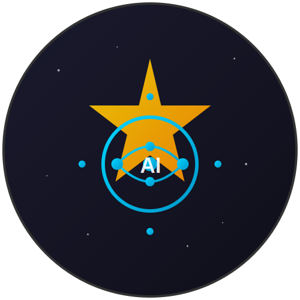

<p align="center">
  
</p>

<h1 align="center">NINA AI Assistant</h1>

<p align="center">
  <strong>🤖 AI-powered astrophotography assistant for N.I.N.A. with MCP equipment control</strong>
</p>

<p align="center">
  <a href="#features">Features</a> •
  <a href="#installation">Installation</a> •
  <a href="#configuration">Configuration</a> •
  <a href="#mcp-integration">MCP Integration</a> •
  <a href="#supported-providers">Providers</a> •
  <a href="#contributing">Contributing</a>
</p>

<p align="center">
  
  
  
  
</p>

---

## ✨ Features

### 🎯 Multi-Provider AI Support

Connect to your preferred AI service - **free or paid**:

| Provider | Cost | Best For |
|----------|------|----------|
| **GitHub Models** | 🆓 Free | Getting started, general use |
| **Google Gemini** | 🆓 Free tier | Fast responses, good quality |
| **Ollama** | 🆓 Free (local) | Privacy, offline use |
| **Anthropic Claude** | 💰 Paid | **MCP equipment control**, best reasoning |
| **OpenAI** | 💰 Paid | GPT-4o, proven reliability |
| **OpenRouter** | 💰 Pay-per-use | Access to many models |

### 🔧 MCP Equipment Control (Anthropic Claude)

With **Model Context Protocol (MCP)** enabled, Claude can **directly control your NINA equipment**:

- 📷 **Camera**: Connect, capture images, set cooling, adjust settings
- 🔭 **Mount**: Slew to targets, park/unpark, tracking control
- 🎯 **Focuser**: Move to position, auto-focus integration
- 🎨 **Filter Wheel**: Change filters programmatically
- ⭐ **Guider**: Start/stop guiding, calibration
- 🏠 **Dome**: Open/close shutter, sync with mount

**Example commands:**
```
"Check my equipment status"
"Connect to the camera and set cooling to -10°C"
"Slew to M31"
"Take a 30 second exposure with the Ha filter"
```

### 💬 Interactive AI Chat Panel

- Dockable chat panel within NINA
- Real-time equipment status queries
- Astrophotography advice and troubleshooting
- Session planning assistance

---

## 📦 Installation

### From NINA Plugin Manager (Recommended)

1. Open NINA → **Options** → **Plugins**
2. Search for "**AI Assistant**"
3. Click **Install**
4. Restart NINA

### Manual Installation

1. Download the latest release from [Releases](../../releases)
2. Extract to `%localappdata%\NINA\Plugins\3.0.0\AI Assistant\`
3. Restart NINA

---

## ⚙️ Configuration

### Step 1: Choose Your AI Provider

Go to **Options** → **Plugins** → **AI Assistant**

### Step 2: Configure API Key

<details>
<summary><b>🆓 GitHub Models (Free)</b></summary>

1. Visit [github.com/settings/tokens](https://github.com/settings/tokens)
2. Generate a new token (classic) with basic permissions
3. Paste the token in the plugin settings
4. Select a model (e.g., `gpt-4o-mini`)

</details>

<details>
<summary><b>🆓 Google Gemini (Free tier)</b></summary>

1. Visit [makersuite.google.com/app/apikey](https://makersuite.google.com/app/apikey)
2. Create an API key
3. Paste the key in plugin settings
4. Select `gemini-1.5-flash` or `gemini-1.5-pro`

</details>

<details>
<summary><b>🆓 Ollama (Local, Free)</b></summary>

1. Install Ollama from [ollama.ai](https://ollama.ai)
2. Run `ollama pull llama3.2` (or your preferred model)
3. Set endpoint to `http://localhost:11434`
4. Select the model you pulled

</details>

<details>
<summary><b>💰 Anthropic Claude (MCP Enabled)</b></summary>

1. Visit [console.anthropic.com](https://console.anthropic.com/)
2. Create an API key
3. Paste the key in plugin settings
4. Select model (e.g., `claude-sonnet-4-20250514`)
5. ✅ Enable **MCP Control** for equipment integration

</details>

<details>
<summary><b>💰 OpenAI</b></summary>

1. Visit [platform.openai.com/api-keys](https://platform.openai.com/api-keys)
2. Create an API key
3. Paste the key in plugin settings
4. Select model (e.g., `gpt-4o`, `gpt-4o-mini`)

</details>

---

## 🔌 MCP Integration

### Requirements

1. **NINA Advanced API Plugin** - Install from NINA Plugin Manager
2. **Anthropic Claude** as the AI provider
3. **MCP Enabled** checkbox checked in settings

### Setup

1. Install the **NINA Advanced API** plugin
2. Ensure it's running on port `1888` (default)
3. In AI Assistant settings:
   - Select **Anthropic Claude (MCP)** as provider
   - Check **Enable MCP Control**
   - Verify NINA Host: `localhost` and Port: `1888`
4. Click **Test MCP Connection**

### Available MCP Tools

| Category | Tools |
|----------|-------|
| **Status** | `nina_get_status`, `nina_get_version` |
| **Camera** | `nina_connect_camera`, `nina_capture_image`, `nina_start_cooling`, `nina_abort_exposure` |
| **Mount** | `nina_connect_mount`, `nina_slew_mount`, `nina_park_mount`, `nina_set_tracking_mode` |
| **Focuser** | `nina_connect_focuser`, `nina_move_focuser` |
| **Filter Wheel** | `nina_connect_filterwheel`, `nina_change_filter` |
| **Guider** | `nina_start_guiding`, `nina_stop_guiding`, `nina_calibrate_guider` |
| **Dome** | `nina_connect_dome`, `nina_open_dome_shutter`, `nina_park_dome` |

---

## 🏗️ Building from Source

### Prerequisites

- Visual Studio 2022 or later
- .NET 8.0 SDK
- NINA 3.x installed

### Build

```bash
git clone https://github.com/michelebergo/NINA_AI_plugin.git
cd NINA_AI_plugin
dotnet build -c Release
```

The plugin will be automatically copied to your NINA plugins folder.

---

## 📁 Project Structure

```
NINA.Plugin.AIAssistant/
├── AI/
│   ├── AIService.cs           # Main AI service orchestrator
│   ├── AIModels.cs            # Request/Response models
│   ├── MCP/
│   │   ├── MCPModels.cs       # MCP data structures
│   │   └── NINAAdvancedAPIClient.cs  # NINA API integration
│   └── Providers/
│       ├── AnthropicProvider.cs   # Claude with MCP tools
│       ├── GitHubModelsProvider.cs
│       ├── GoogleProvider.cs
│       ├── OllamaProvider.cs
│       ├── OpenAIProvider.cs
│       └── OpenRouterProvider.cs
├── AIChatVM.cs                # Chat panel view model
├── AIChatTemplate.xaml        # Chat UI template
├── Options.xaml               # Settings UI
└── AIAssistantPlugin.cs       # Plugin entry point
```

---

## 🤝 Contributing

Contributions are welcome! Please feel free to submit a Pull Request.

1. Fork the repository
2. Create your feature branch (`git checkout -b feature/AmazingFeature`)
3. Commit your changes (`git commit -m 'Add some AmazingFeature'`)
4. Push to the branch (`git push origin feature/AmazingFeature`)
5. Open a Pull Request

---

## 📄 License

This project is licensed under the **Mozilla Public License 2.0** - see the [LICENSE.txt](LICENSE.txt) file for details.

---

## 🙏 Acknowledgments

- [N.I.N.A.](https://nighttime-imaging.eu/) - The amazing astrophotography software
- [NINA Advanced API](https://github.com/christian-photo/ninaAPI) - API integration for NINA
- [Anthropic](https://anthropic.com/) - Claude AI with tool-use capabilities
- The astrophotography community

---

<p align="center">
  Made with ❤️ for the astrophotography community
</p>
